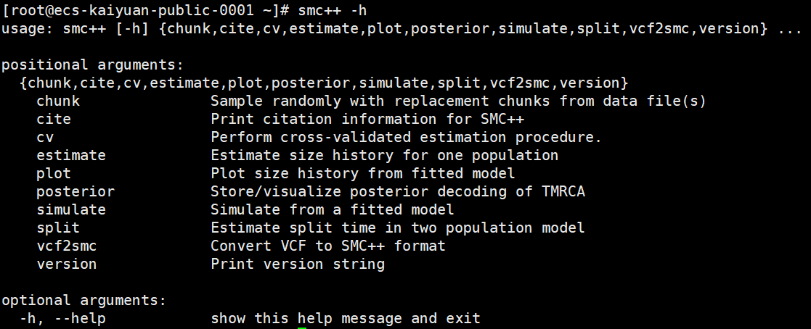

# SMC++种群大小历史估计使用指南

# 一、商品链接

# 二、商品说明

SMC++是一个用于从全基因组测序数据中估计种群大小历史的程序。

本商品通过鲲鹏服务器+Huawei Cloud EulerOS 2.0 64bit系统进行安装部署。

# 三、商品购买

您可以在云商店搜索”SMC++种群大小历史估计程序“找到该商品。

其中，地域、规格、推荐配置使用默认，购买方式根据您的需求选择按需/按月/按年，短期使用推荐按需，长期使用推荐按月/按年，确认配置后点击“立即购买”。

# 四、商品资源配置

本商品支持ECS控制台配置，下面对资源配置的方式进行介绍。

## 4.1 ECS 控制台配置

### 准备工作

在使用ECS控制台配置前，需要您提前配置好 **安全组规则**。

> **安全组规则的配置如下：**
>
> - 入方向规则放通 CloudShell 连接实例使用的端口 `22`，以便在控制台登录调试
> - 出方向规则一键放通

### 创建ECS

前提工作准备好后，在 ECS 控制台配置跳转到[购买ECS](https://support.huaweicloud.com/qs-ecs/ecs_01_0103.html) 页面，ECS 资源的配置如下图所示：

选择CPU架构

选择服务器规格

选择镜像规格

其他参数根据实际情况进行填写，填写完成之后，点击立即购买即可

> **值得注意的是：**
>
> - VPC 您可以自行创建
> - 安全组选择 [**准备工作**](#准备工作) 中配置的安全组；
> - 弹性公网IP选择现在购买，推荐选择“按流量计费”，带宽大小可设置为5Mbit/s；
> - 高级配置需要在高级选项支持注入自定义数据，所以登录凭证不能选择“密码”，选择创建后设置；
> - 其余默认或按规则填写即可。

# 五、商品使用

SMC++是一个用于从全基因组测序数据中估计种群大小历史的程序，兼容VCF格式，具备种群历史估计与可视化等功能。

本商品基于官方Github仓库的源码构建，镜像制作时最新已验证Commit编号为6779fae，可执行程序默认安装于`/usr/local/bin`目录下。

## 命令行使用

登录服务器，在任一目录下执行`smc++ -h`,可得以下输出：

可以发现，SMC++包含若干子命令，其中`vcf2smc`用于将VCF格式数据转化为SMC++可用的数据格式，`estimate`用于对数据进行种群大小历史估计等。具体使用方法及示例数据获取，请参考官方文档[https://github.com/popgenmethods/smcpp](https://github.com/popgenmethods/smcpp)

## 参考文档

[SMC++官方仓库](https://github.com/popgenmethods/smcpp)
